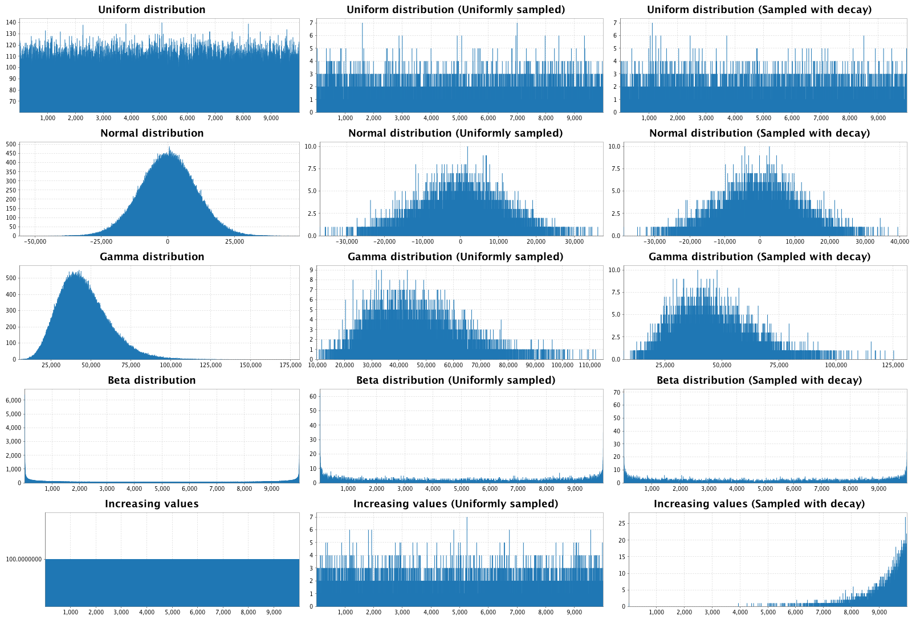

A simple experiment to learn how to use [Scalala](https://github.com/scalala/Scalala) that plots histograms for the reservoir sampling algorithms (uniform, with exponential decay) used in the [Metrics](https://github.com/codahale/metrics) library.

In order to run this, you'll need to apply the patch [metrics.patch] to the BETA19 version of the metrics library.

Then, simply run it via `sbt` and you'll get a plot like this:

